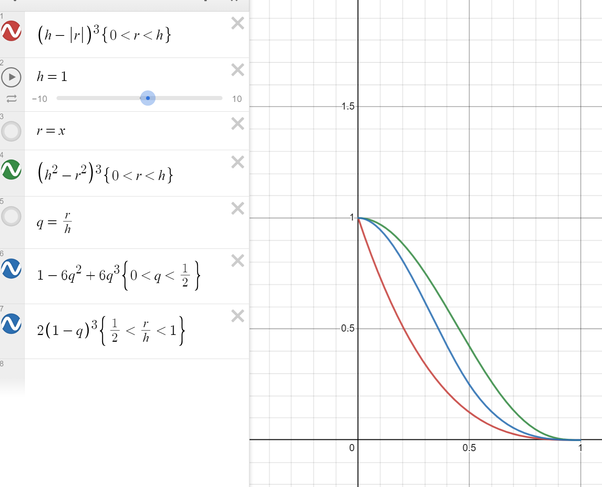

# Notas

## Los kernels
Para el cubic spline para el caso 3D. Ambos artículos presentan constantes distintas.
$$
W(r,h) = 
\begin{cases} 
6(\frac{r^3}{h^3}-\frac{r^2}{h^2} ) & \text{si } 0\leq \frac{r}{h}\leq \frac{1}{2} \\
2(1-\frac{r}{h})^3 & \text{si } \frac{1}{2} \leq \frac{r}{h}\leq 1
\end{cases}
$$
$$k_1=\frac{8}{\pi h^3}$$. 
$$k_2=\frac{1}{\pi h^3}$$$.

Estas constantes existen para satisfacer la condición de unicidad.

$$\int_{-\infty}^{\infty}W_{normalizado}(r,h)dr=1$$

$$k\int_{-\infty}^{\infty}W(r,h)dr=1$$

$$\int_{-\infty}^{\infty}W(r,h)dr=\frac{1}{k}$$

Para el caso tridimensional.
$$\int_0^{2\pi}\int_0^{\pi}\int_{0}^{\infty} W_n(r,h)dV=1$$

$$\int_0^{2\pi}\int_0^{\pi}\int_{0}^{\infty} W_n(r,h)r^2\sin(\theta)drd\theta d\phi=1$$

$$\int_0^{2\pi}\int_0^{\pi}\int_{0}^{\infty} W(r,h)r^2\sin(\theta)drd\theta d\phi=\frac{1}{k}$$

Para el spline cúbico:

$$\int_0^{2\pi}\int_0^{\pi}\int_{0}^{\infty} W(r,h)r^2\sin(\theta)drd\theta d\phi=\frac{\pi h^3}{6}$$

Por lo que se encontró $k_3=\frac{6}{\pi h^3}$

Todo esto es cuestión de escala, lo importante es que el factor se divide por $h^3$, de otro modo, en la forma de estimar propiedades.

$$A_{(x)}=\sum\limits_{i}A_i\frac{m_i}{\rho_i}W_n(r_i,h)$$
Al ser una suma directa, cambia la influencia de cada partícula $i$, pero al incrementar el volumen de búsqueda-influencia $(h^3)$, eso aumentaría la cantidad medida, normalizar la unidad de volumen es dividir por $h^3$. Lo demás es factor de escala. 

De lo que he podido ver con mis pruebas en "kernel_test.cpp". Por alguna razón la condición de unicidad falla cuando es una función a trozos.
En este archivo se montó una prueba de los kernels. Distribuyendo uniformemente una gran cantidad de partículas (en el orden de miles), se toma una partícula central como punto de prueba y se cambia el valor de h.

En kernel_test.exe se cambia de partícula usando las flechas izquierda y derecha del teclado. Se cambia el radio de influencia h con las teclas "A" para incrementar y "Z" para disminuir. En consola imprime el valor de la densidad calculado. 

Se necesita hacer más pruebas, por ahora los kernels que cumplen la condición de uniformidad independiente de escala son:

* [El kernel de sebastian lague](https://www.youtube.com/watch?v=rSKMYc1CQHE)\
	$$
	W_s(r,h)=\frac{4}{\pi h^8} (h^2-r^2)^3
	$$

* [Kernel gaussiano ](https://github.com/ashcat2005/CA2023-03/blob/cpp/01.SPH.ipynb)
	$$
	W_e(r,h) = \left( \frac{1}{h\sqrt{\pi}}\right)^d e^{ -\frac{\left| \vec{r} \right|^2}{h^2}}
	$$

Notar que para mantener $W_s$ positivo, se necesita que si $r>h \rightarrow W_s=0$. A diferencia del kernel gaussiano. El hecho de que $W_s$ esté limitado a una distancia h, nos permite hacer una cuadrícula para optimización espacial sin perder precisión, mientras que usar el kernel gaussiano (cuyo rango de influencia es infinito) perdería precisión. Esto tambien implica que para h de orde de magnitud de $\frac{1}{100}$ del dominio de la simulacion no debe utilizarse a menos de que se usen condiciones de frontera especiales.

Eso sumado a que mismos kernels aparecen en la literatura con distintas condiciones de normalizacion, no se debe dar los kernels que se encuentra por sentado. 

## Referencias
Estas son las referencias más notables que encontre

https://www.diva-portal.org/smash/get/diva2:573583/FULLTEXT01.pdf
https://matthias-research.github.io/pages/publications/sca03.pdf
https://core.ac.uk/download/pdf/82166338.pdf
https://www.researchgate.net/publication/266223633_Real-time_particle_simulation_of_fluids
https://web.archive.org/web/20140725014123/https://docs.nvidia.com/cuda/samples/5_Simulations/particles/doc/particles.pdf
https://sph-tutorial.physics-simulation.org/pdf/SPH_Tutorial.pdf -> los kernels vienen de aqui.
https://www.particleworks.com/technical_column_vol3_02_en.html   -> aqui aparece el mismo kernel de cubic spline. Pero tienen constantes de normalización distinta.

