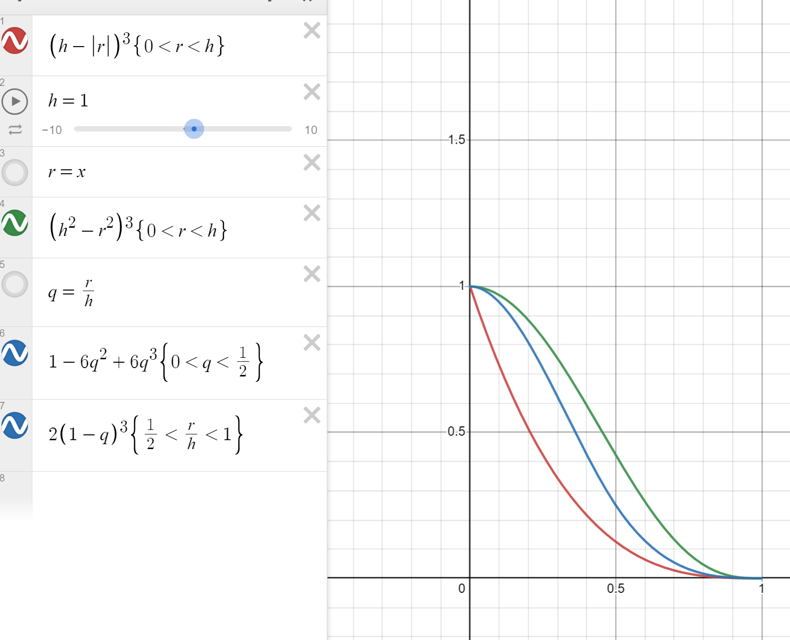

# Referencias
Estas son las referencias mas notables que encontre

https://www.diva-portal.org/smash/get/diva2:573583/FULLTEXT01.pdf
https://matthias-research.github.io/pages/publications/sca03.pdf
https://core.ac.uk/download/pdf/82166338.pdf
https://web.archive.org/web/20140725014123/https://docs.nvidia.com/cuda/samples/5_Simulations/particles/doc/particles.pdf
https://sph-tutorial.physics-simulation.org/pdf/SPH_Tutorial.pdf -> los kernels vienen de aqui.

https://www.particleworks.com/technical_column_vol3_02_en.html   -> aqui aparece el mismo kernel de cubic spline. Pero tienen constantes de normalizacion distinta.

Para el cubic spline para el caso 3D. Ambos articulos presentan constantes distintas.
$k_1=\frac{8}{\pi h^3}$. 
$k_2=\frac{1}{\pi h^3}$.

Estas constantes existen para satisfacer la condicion de unicidad.

$\int_{-\infty}^{\infty}W_{normalizado}(r,h)dr=1$

$k\int_{-\infty}^{\infty}W(r,h)dr=1$

$\int_{-\infty}^{\infty}W(r,h)dr=\frac{1}{k}$

Para el caso tridimensional.
$\int_0^{2\pi}\int_0^{\pi}\int_{0}^{\infty} W_n(r,h)dV=1$

$\int_0^{2\pi}\int_0^{\pi}\int_{0}^{\infty} W_n(r,h)r^2\sin(\theta)drd\theta d\phi=1$

$\int_0^{2\pi}\int_0^{\pi}\int_{0}^{\infty} W(r,h)r^2\sin(\theta)drd\theta d\phi=\frac{1}{k}$

Para el spline cubico:

$\int_0^{2\pi}\int_0^{\pi}\int_{0}^{\infty} W(r,h)r^2\sin(\theta)drd\theta d\phi=\frac{\pi h^3}{6}$

Es decir, se encontro $k_3=\frac{6}{\pi h^3}$

Todo esto es cuestion de escala, lo importante es que el factor divide por $h^3$, de otro modo, en la forma de estimar propiedades.

$A_{(x)}=\sum\limits_{i}A_i\frac{m_i}{\rho_i}W_n(r_i,h)$
Al se una suma directa, cambia la influencia de cada particula $i$, pero al incrementar el volumen de busqueda-influencia $(h^3)$, eso aumentaria la cantidad medida, normalizar a unidad de volumen es dividir por $h^3$. Lo demas es factor de escala. 

